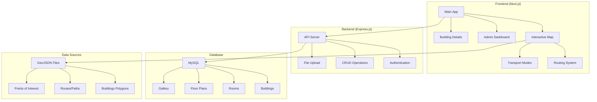

# PointMap - Documentation Index

_Comprehensive documentation for PointMap campus interactive mapping system_

## 📚 Documentation Structure

### 🎯 Main Documentation

| Document                                                                   | Description                                                   | Target Audience                            |
| -------------------------------------------------------------------------- | ------------------------------------------------------------- | ------------------------------------------ |
| [`frontend/FRONTEND_DOCUMENTATION.md`](frontend/FRONTEND_DOCUMENTATION.md) | Complete frontend architecture, components, and features      | Frontend developers, Full-stack developers |
| [`backend/API_DOCUMENTATION.md`](backend/API_DOCUMENTATION.md)             | Backend API endpoints, database structure, and implementation | Backend developers, API consumers          |

### 🔧 Technical Specifications

| Document                                                                          | Description                                     | Focus Area                      |
| --------------------------------------------------------------------------------- | ----------------------------------------------- | ------------------------------- |
| [`frontend/ROUTING_SYSTEM.md`](frontend/ROUTING_SYSTEM.md)                        | Advanced routing algorithm using GeoJSON paths  | Routing, Navigation, Algorithms |
| [`frontend/TRANSPORT_MODE_FEATURE.md`](frontend/TRANSPORT_MODE_FEATURE.md)        | Transport mode implementation (Walking/Vehicle) | User Features, Transport Logic  |
| [`frontend/MULTI_ROUTE_DEBUG.md`](frontend/MULTI_ROUTE_DEBUG.md)                  | Debug guide for multiple routes to buildings    | Debugging, Troubleshooting      |
| [`public/building-details/README.md`](frontend/public/building-details/README.md) | Building detail system documentation            | Building Features, 3D Views     |

### 📋 Project Structure

| Document                                     | Description                        | Purpose                  |
| -------------------------------------------- | ---------------------------------- | ------------------------ |
| [`FOLDER_STRUCTURE.md`](FOLDER_STRUCTURE.md) | Complete project folder structure  | Project Organization     |
| This file                                    | Documentation index and navigation | Documentation Navigation |

## 🚀 Quick Start Guide

### For Developers

1. **Backend Setup**:

   ```bash
   cd backend
   npm install
   # Setup .env file (see backend/API_DOCUMENTATION.md)
   npm start
   ```

2. **Frontend Setup**:

   ```bash
   cd frontend
   npm install
   npm run dev
   ```

3. **Database Setup**:
   ```bash
   mysql -u root -p pointmap < pointmap.sql
   ```

### For Users

- **Main Application**: Access the interactive map at `http://localhost:3000`
- **Admin Dashboard**: Login at `http://localhost:3000/dashboard`
- **Building Details**: Standalone system at `/public/building-details/`

## 🏗️ System Architecture



## 🎯 Key Features Documentation

### 🗺️ Map & Navigation

- **Interactive Leaflet Map**: 7 basemap options, responsive design
- **Advanced Routing**: Multi-path algorithm using real GeoJSON routes
- **Transport Modes**: Walking vs Vehicle with different rules
- **GPS Integration**: User location with fallback handling

### 🏢 Building Management

- **Dynamic Building Details**: Database-driven content with 3D views
- **Floor Plan System**: SVG-based interactive floor plans
- **Room Management**: Complete CRUD operations for rooms
- **Gallery System**: Photo management with drag-and-drop reordering

### 🔐 Admin System

- **JWT Authentication**: Secure login with 1-hour token expiry
- **Dashboard Interface**: Full data management capabilities
- **File Upload**: Single and multiple file upload support
- **Real-time Updates**: Live data refresh after operations

### 🎨 User Experience

- **Dark/Light Theme**: System preference detection with manual toggle
- **Weather Integration**: Real-time weather data with location detection
- **Responsive Design**: Mobile-first approach with touch gestures
- **Progressive Web App**: Offline capabilities and app-like experience

## 📊 Technical Stack

### Frontend Technologies

- **Framework**: Next.js 15.3.3 with App Router
- **Language**: TypeScript for type safety
- **Styling**: Tailwind CSS for utility-first styling
- **Maps**: Leaflet.js with custom routing algorithms
- **State**: React hooks and context for state management

### Backend Technologies

- **Runtime**: Node.js with Express.js
- **Database**: MySQL with Sequelize ORM
- **Authentication**: JWT with bcrypt password hashing
- **File Upload**: Multer middleware
- **API**: RESTful design with proper HTTP status codes

### Data & Assets

- **Geospatial**: GeoJSON format for buildings, routes, and points
- **Images**: SVG floor plans, JPG/PNG galleries
- **Database**: Relational design with foreign key constraints
- **Files**: Organized upload system with path storage

## 🔍 Feature Cross-Reference

| Feature            | Frontend Doc           | Backend Doc           | Technical Doc                 |
| ------------------ | ---------------------- | --------------------- | ----------------------------- |
| Routing System     | ✅ Components section  | ❌ (Frontend-only)    | ✅ ROUTING_SYSTEM.md          |
| Transport Modes    | ✅ Features section    | ❌ (Frontend-only)    | ✅ TRANSPORT_MODE_FEATURE.md  |
| Authentication     | ✅ Security section    | ✅ Auth endpoints     | ❌                            |
| File Upload        | ✅ Admin features      | ✅ Upload endpoints   | ❌                            |
| Building Details   | ✅ Components section  | ✅ Bangunan endpoints | ✅ building-details/README.md |
| Database Relations | ❌ (Backend concern)   | ✅ Relations section  | ❌                            |
| API Integration    | ✅ Backend integration | ✅ Frontend notes     | ❌                            |

## 🚨 Important Notes

### Security Considerations

- JWT tokens expire in 1 hour for enhanced security
- Password hashing with bcrypt salt rounds 10
- Protected endpoints require authentication headers
- File upload validation and size limits

### Performance Notes

- Code splitting with Next.js dynamic imports
- Image optimization with Next.js Image component
- Efficient GeoJSON processing for large datasets
- Database query optimization with includes and ordering

### Deployment Considerations

- Environment variables for configuration
- CORS setup for cross-origin requests
- Upload folder permissions for file storage
- Database migration and seeding strategies

## 🔄 Recent Updates (December 2024)

### Backend Updates

- ✅ Enhanced file upload system with Multer
- ✅ Gallery reordering functionality
- ✅ 3D view specific endpoints
- ✅ Improved security with shorter token expiry
- ✅ Better error handling and logging

### Frontend Updates

- ✅ Advanced routing with multiple path support
- ✅ Transport mode selection with different rules
- ✅ Enhanced mobile experience
- ✅ Improved admin dashboard with real-time updates
- ✅ Better error handling and user feedback

### Documentation Updates

- ✅ Complete frontend documentation
- ✅ Updated API documentation with all endpoints
- ✅ Cross-reference between frontend and backend
- ✅ Technical specifications for complex features

## 📞 Support & Maintenance

### For Issues

1. Check the relevant documentation section
2. Review debug guides (especially MULTI_ROUTE_DEBUG.md)
3. Check console logs for detailed error messages
4. Verify environment variables and database connections

### For Development

1. Follow the folder structure guidelines
2. Maintain consistency between frontend and backend
3. Update documentation when adding new features
4. Test all CRUD operations and file uploads

---

_This index provides navigation to all PointMap documentation. Each document contains detailed information for its specific domain._
