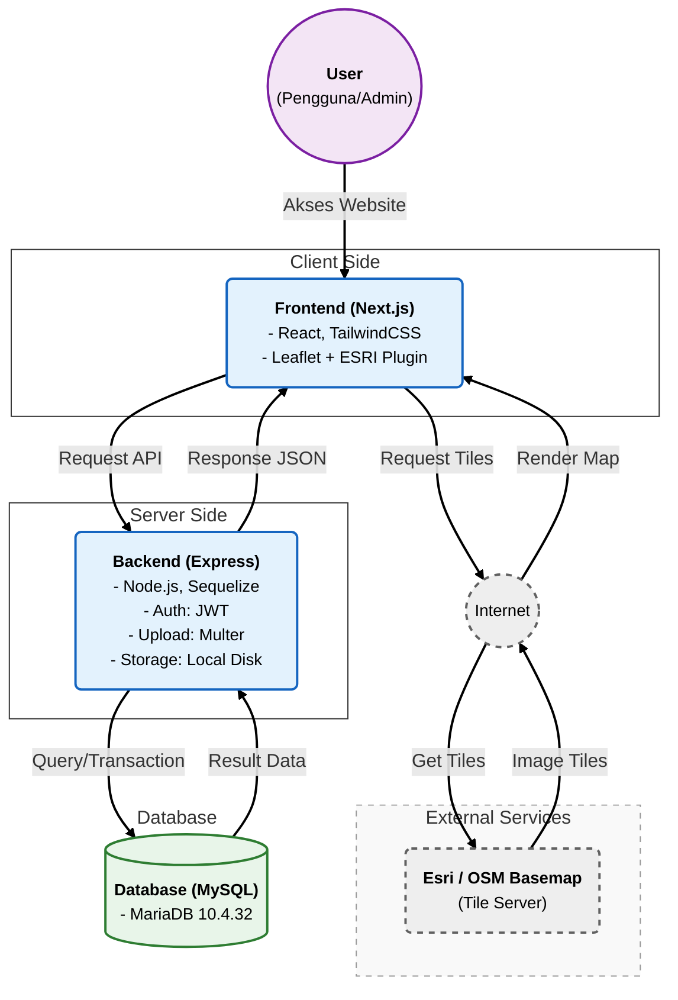

# Arsitektur Sistem PointMap (Revised)

Diagram arsitektur sistem PointMap (High Contrast & Professional).
Mermaid Code untuk [Mermaid Live Editor](https://mermaid.live).

```mermaid
graph TD
    %% Nodes
    User(("<b>User</b><br/>(Pengguna/Admin)"))

    subgraph ClientSide ["Client Side"]
        style ClientSide fill:#fff,stroke:#333,stroke-width:1px
        Client["<b>Frontend (Next.js)</b><br/>- React, TailwindCSS<br/>- Leaflet + ESRI Plugin"]
    end

    Internet((Internet))

    subgraph Services ["External Services"]
        style Services fill:#f9f9f9,stroke:#999,stroke-width:1px,stroke-dasharray: 5 5
        TileServer("<b>Esri / OSM Basemap</b><br/>(Tile Server)")
    end

    subgraph ServerSide ["Server Side"]
        style ServerSide fill:#fff,stroke:#333,stroke-width:1px
        Backend["<b>Backend (Express)</b><br/>- Node.js, Sequelize<br/>- Auth: JWT<br/>- Upload: Multer<br/>- Storage: Local Disk"]
    end

    subgraph DB ["Database"]
        style DB fill:none,stroke:none
        Database[("<b>Database (MySQL)</b><br/>- MariaDB 10.4.32")]
    end

    %% Connections
    User -->|Akses Website| Client

    %% Client to Backend
    Client -->|Request API| Backend
    Backend -->|Response JSON| Client

    %% Client to Map Tiles (via Internet)
    Client -->|Request Tiles| Internet
    Internet -->|Get Tiles| TileServer
    TileServer -->|Image Tiles| Internet
    Internet -->|Render Map| Client

    %% Backend to Database
    Backend -->|Query/Transaction| Database
    Database -->|Result Data| Backend

    %% Styling Definitions
    classDef default font-family:Arial,font-size:14px,fill:#fff,stroke:#333,stroke-width:1px;

    %% User Style - Ungu Profesional
    classDef user fill:#F3E5F5,stroke:#7B1FA2,stroke-width:2px,color:#000000;
    class User user;

    %% Component Style (Frontend/Backend) - Biru Profesional
    classDef component fill:#E3F2FD,stroke:#1565C0,stroke-width:2px,color:#000000,rx:5,ry:5;
    class Client,Backend component;

    %% Database Style - Hijau Data
    classDef database fill:#E8F5E9,stroke:#2E7D32,stroke-width:2px,color:#000000;
    class Database database;

    %% External Service Style - Abu-abu Netral
    classDef external fill:#EEEEEE,stroke:#616161,stroke-width:2px,stroke-dasharray: 5 5,color:#000000;
    class Internet,TileServer external;

    %% Link Style - Hitam Tegas
    linkStyle default stroke:#000000,stroke-width:2px,fill:none;
```
