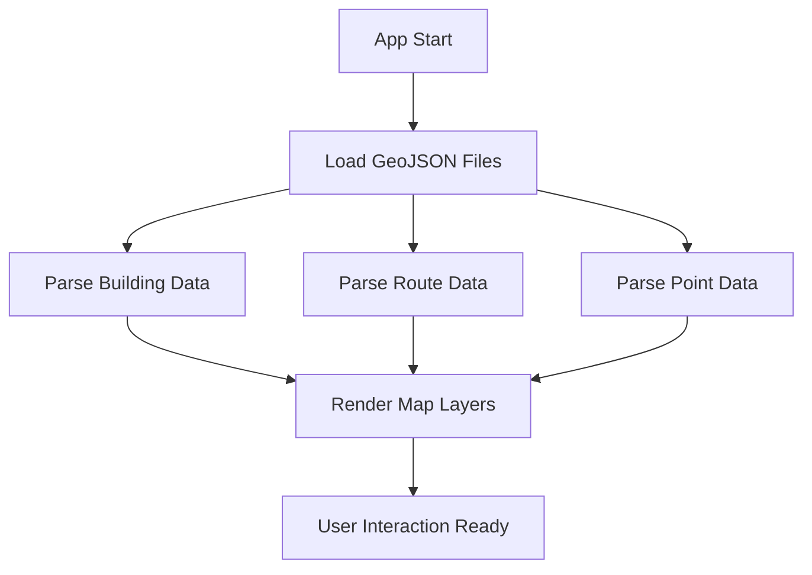
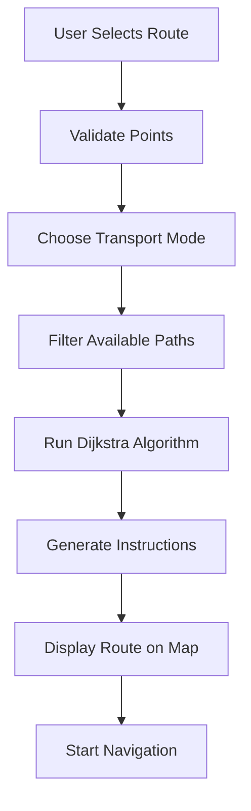
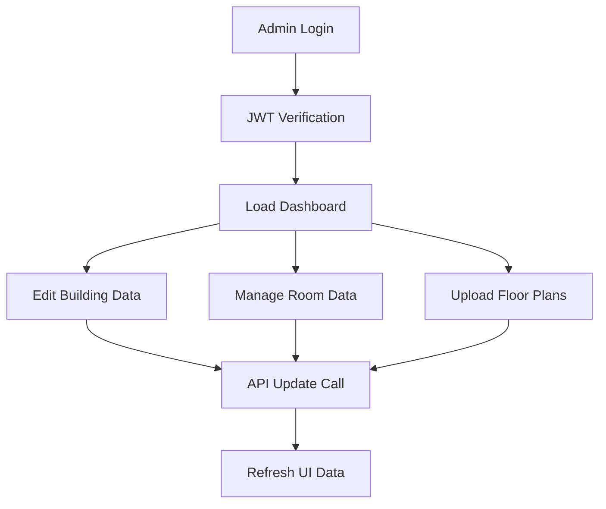
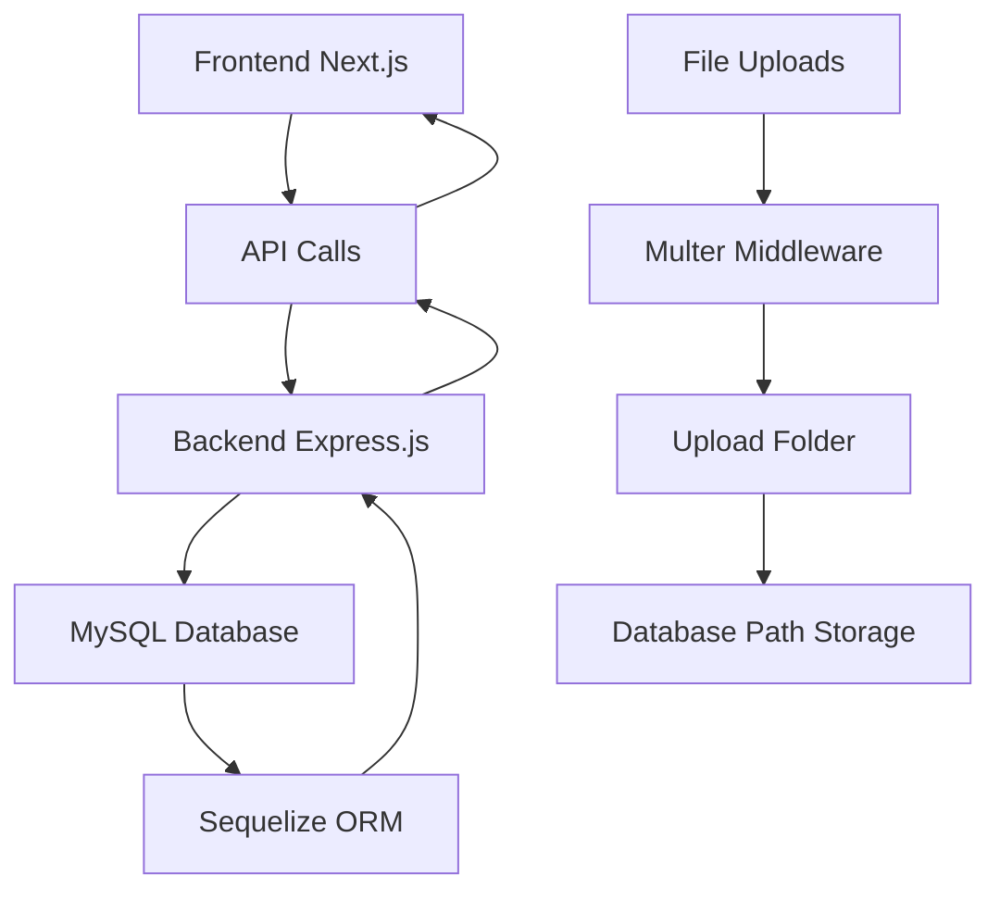

# Frontend Documentation - PointMap

## 📱 Aplikasi Overview

PointMap Frontend adalah aplikasi web Next.js yang menyediakan interface interaktif untuk menjelajahi peta kampus Politeknik Negeri Pontianak dengan fitur routing, navigasi, dan manajemen data bangunan dan ruangan.

## 🏗️ Arsitektur & Teknologi

### Framework & Library Utama

- **Next.js 15.3.3**: React framework dengan App Router
- **React 19.0**: Library UI utama
- **TypeScript**: Type safety dan development experience
- **Tailwind CSS**: Utility-first CSS framework
- **Leaflet.js**: Interactive maps dan geospatial features

### Dependencies Khusus

```json
{
  "leaflet": "^1.9.4", // Peta interaktif
  "esri-leaflet": "^3.0.17", // ArcGIS integration
  "react-slick": "^0.30.3", // Image slider
  "next-themes": "^0.4.6", // Dark/light theme
  "react-icons": "^5.5.0", // Icon library
  "dijkstrajs": "^1.0.3", // Pathfinding algorithm
  "graphlib": "^2.1.8", // Graph data structure
  "react-tsparticles": "^2.12.2" // Particle effects
}
```

## 📁 Struktur Folder

```
frontend/
├── src/
│   ├── app/
│   │   ├── dashboard/page.tsx          # Dashboard admin dengan peta dan data management
│   │   ├── login/page.tsx              # Halaman login admin
│   │   ├── page.tsx                    # Halaman utama dengan peta publik
│   │   ├── layout.tsx                  # Root layout dengan theme provider
│   │   ├── globals.css                 # Global styles
│   │   └── theme-provider.tsx          # Theme context provider
│   ├── components/
│   │   ├── LeafletMap.tsx              # Komponen peta utama dengan semua fitur
│   │   ├── ParticlesCustom.tsx         # Background particle effects
│   │   ├── useGps.ts                   # Hook untuk GPS functionality
│   │   └── useRouting.ts               # Hook untuk routing functionality
│   └── lib/
│       ├── routing.ts                  # Core routing algorithms
│       └── routeSteps.ts               # Route instruction generation
├── public/
│   ├── geojson/                        # Data geospatial
│   │   ├── Jalur WGS_1984.geojson     # Path/route data
│   │   ├── Polnep WGS_1984.geojson    # Building polygon data
│   │   └── Titik WGS_1984.geojson     # Point of interest data
│   ├── img/                           # Static images dan building assets
│   ├── building-details/              # Standalone building detail system
│   └── Slider/                        # Hero section background images
└── docs/
    ├── ROUTING_SYSTEM.md              # Dokumentasi sistem routing
    ├── TRANSPORT_MODE_FEATURE.md      # Dokumentasi mode transportasi
    └── MULTI_ROUTE_DEBUG.md           # Debug guide untuk multiple routes
```

## 🎯 Fitur Utama

### 1. **Interactive Map System**

- **Multi-basemap support**: 7 basemap options (satellite, topographic, OpenStreetMap, etc.)
- **Responsive design**: Mobile-first dengan touch gestures
- **Theme integration**: Dark/light mode support
- **Real-time data**: Dynamic loading dari backend API

### 2. **Advanced Routing System**

#### Multi-Path Routing

- Menggunakan jalur GeoJSON sebenarnya (bukan garis lurus)
- Support untuk multiple connected paths
- Smart direction detection
- Path traversal algorithm dengan Dijkstra

#### Transport Modes

- **Jalan Kaki (Walking)** 🚶:

  - Prioritas jalur "pejalan kaki"
  - Kecepatan: 4 km/h
  - Bi-directional untuk semua jalur
  - Instruksi: "Jalan X meter"

- **Kendaraan (Vehicle)** 🏍️:
  - Wajib menggunakan jalur "both"
  - Kecepatan: 20 km/h
  - Oneway restrictions berlaku
  - Access routes untuk area pejalan kaki
  - Instruksi: "X meter"

#### Route Instructions

- Turn-by-turn navigation
- Distance dan time calculation
- Visual indicators (belok kiri/kanan/lurus)
- Multi-language support (Indonesian)

### 3. **Building & Room Management**

#### Dynamic Building Details

- Database-driven content
- Multi-floor support dengan SVG floor plans
- Real-time room information
- Gallery management system

#### Search & Discovery

- Real-time search dengan autocomplete
- Filter by building, room, department
- GPS-based "Lokasi Saya" integration
- Point of Interest discovery

### 4. **Admin Dashboard**

#### Data Management

- Building information editing
- Room data management
- Floor plan upload dan management
- Gallery foto management
- Real-time preview

#### Authentication

- JWT-based authentication
- Session management
- Protected routes
- Admin-only features

### 5. **User Experience Features**

#### Weather Integration

- Real-time weather data
- Location-based weather info
- Indonesian weather descriptions
- Weather-appropriate icons

#### GPS & Location

- Auto-detect user location
- Permission handling
- Fallback for denied permissions
- Location accuracy indicators

#### Responsive Design

- Mobile-first approach
- Touch-friendly controls
- Adaptive layouts
- Cross-device compatibility

## 🔧 Komponen Utama

### LeafletMap Component

**File**: `src/components/LeafletMap.tsx` (7,250+ lines)

Komponen utama yang menangani semua fungsi peta:

```typescript
interface LeafletMapProps {
  isDark?: boolean;
  initialLat?: number;
  initialLng?: number;
  initialZoom?: number;
  className?: string;
  isDashboard?: boolean;
}

interface LeafletMapRef {
  highlightFeature: (featureId: string | number) => void;
  clearHighlight: () => void;
  recenterMap: () => void;
}
```

#### Key Features:

- **Map Initialization**: Leaflet setup dengan multiple basemaps
- **Data Loading**: GeoJSON loading dan parsing
- **Search System**: Real-time search dengan autocomplete
- **Routing Engine**: Complete routing system dengan instructions
- **Admin Features**: Data editing dan management
- **Interactive Elements**: Click handlers, popups, modals
- **Layer Management**: Multiple data layers dengan controls

### Theme System

**File**: `src/app/theme-provider.tsx`

```typescript
// Theme context dengan Next.js themes
import { ThemeProvider } from "next-themes";

// Automatic theme detection
// System preference support
// Smooth transitions
```

### Custom Hooks

#### useGps Hook

**File**: `src/components/useGps.ts`

```typescript
export function useGps() {
  const [location, setLocation] = useState<GeolocationPosition | null>(null);
  const [loading, setLoading] = useState(false);
  const [error, setError] = useState<string | null>(null);

  // GPS functionality with error handling
  // Permission management
  // High accuracy positioning
}
```

#### useRouting Hook

**File**: `src/components/useRouting.ts`

```typescript
export type TransportMode = "jalan_kaki" | "kendaraan";

export function useRouting() {
  const [transportMode, setTransportMode] =
    useState<TransportMode>("jalan_kaki");

  // Transport mode management
  // Route calculation coordination
  // State management for routing UI
}
```

## 🛣️ Routing System Detail

### Core Algorithm (`src/lib/routing.ts`)

#### Interfaces

```typescript
interface Point {
  id: string;
  name: string;
  coordinates: [number, number]; // [lat, lng]
}

interface Route {
  id: string;
  startPoint: string;
  endPoint: string;
  coordinates: [number, number][];
  distance: number;
  routeIds: string[];
}
```

#### Key Functions

- `findRoute()`: Main routing function
- `findConnectedRoutes()`: Find paths connected to a point
- `findCompleteRoute()`: Multi-path route finding
- `calculateDistance()`: Haversine distance calculation
- `buildCompleteCoordinates()`: Merge multiple path coordinates

### Route Instructions (`src/lib/routeSteps.ts`)

#### Step Generation

```typescript
export function getStepInstruction(
  idx: number,
  steps: any[],
  transportMode: TransportMode
) {
  // Generate turn-by-turn instructions
  // Handle different transport modes
  // Provide distance and direction info
}
```

#### Bearing Calculation

- Turn detection (left/right/straight)
- Angle calculation between segments
- Direction indicators

## 📊 Data Flow

### 1. **Data Loading Process**



### 2. **Routing Process**



### 3. **Admin Data Management**



## 🎨 UI/UX Design

### Design System

#### Colors (Tailwind)

- **Primary**: Blue shades (`blue-500`, `blue-600`)
- **Secondary**: Gray shades untuk neutral elements
- **Success**: Green untuk positive actions
- **Warning**: Yellow untuk cautions
- **Error**: Red untuk errors dan alerts

#### Typography

- **Primary Font**: Inter (Google Fonts)
- **Display Font**: Oswald (Google Fonts)
- **Icon Font**: Font Awesome 6

#### Components

- **Buttons**: Rounded dengan hover effects
- **Cards**: Shadow elevation dengan rounded corners
- **Modals**: Backdrop blur dengan smooth animations
- **Forms**: Clean inputs dengan validation states

### Responsive Breakpoints

```css
/* Mobile First Approach */
sm: 640px   /* Mobile landscape */
md: 768px   /* Tablet */
lg: 1024px  /* Desktop */
xl: 1280px  /* Large desktop */
2xl: 1536px /* Extra large */
```

### Animation System

- **Micro-interactions**: Hover states, button feedback
- **Page transitions**: Smooth navigation
- **Loading states**: Skeleton screens, spinners
- **Map animations**: Zoom, pan, route drawing

## 🔐 Authentication & Security

### JWT Authentication

```typescript
// Token storage dalam localStorage
// Automatic token refresh
// Protected route middleware
// Session timeout handling
```

### API Integration

```typescript
const API_BASE_URL = "http://localhost:3001/api";

// Authenticated requests
const authHeaders = {
  Authorization: `Bearer ${token}`,
  "Content-Type": "application/json",
};
```

### Input Validation

- Form validation dengan TypeScript
- Sanitization untuk user inputs
- File upload restrictions
- XSS prevention

## 📱 Mobile Optimization

### Touch Interactions

- Gesture support untuk map navigation
- Touch-friendly button sizes (44px minimum)
- Swipe gestures untuk modals
- Pull-to-refresh functionality

### Performance

- Lazy loading untuk images
- Code splitting dengan Next.js
- Optimized bundle sizes
- Progressive Web App features

### Responsive Features

- Mobile-first design approach
- Adaptive layouts
- Collapsible navigation
- Modal adjustments untuk mobile

## 🚀 Development Workflow

### Setup Development Environment

1. **Install Dependencies**

```bash
cd frontend
npm install
```

2. **Environment Variables**

```bash
# Create .env.local
NEXT_PUBLIC_API_URL=http://localhost:3001/api
NEXT_PUBLIC_WEATHER_API_KEY=your_openweather_key
```

3. **Run Development Server**

```bash
npm run dev
# Aplikasi akan tersedia di http://localhost:3000
```

### Build & Deployment

```bash
# Production build
npm run build

# Start production server
npm start

# Lint checking
npm run lint
```

### Development Tools

- **ESLint**: Code linting dengan Next.js rules
- **TypeScript**: Type checking
- **Tailwind CSS**: Utility-first styling
- **PostCSS**: CSS processing
- **Hot Reload**: Real-time development updates

## 🧪 Testing & Debugging

### Debug Features

- Console logging untuk routing decisions
- Network request monitoring
- Performance metrics
- Error boundary handling

### Browser Compatibility

- Modern browsers (Chrome, Firefox, Safari, Edge)
- Mobile browsers (iOS Safari, Android Chrome)
- Progressive enhancement approach

### Common Debug Points

- GPS permission issues
- API connection problems
- Route calculation failures
- Theme switching problems

## 📈 Performance Optimization

### Bundle Optimization

- Code splitting dengan Next.js
- Dynamic imports untuk large components
- Tree shaking untuk unused code
- Image optimization dengan Next.js Image

### Map Performance

- Layer management untuk data rendering
- Efficient GeoJSON processing
- Marker clustering untuk banyak points
- Viewport-based data loading

### User Experience

- Loading states untuk semua async operations
- Error handling dengan user-friendly messages
- Offline support untuk cached data
- Progressive Web App capabilities

## 🔧 Maintenance & Updates

### Regular Tasks

- Update dependencies secara berkala
- Monitor bundle size
- Performance auditing
- Security vulnerability checks

### Data Updates

- GeoJSON files untuk new buildings/routes
- Building images dan floor plans
- Weather API configuration
- Map basemap updates

## 📚 Learning Resources

### Technologies Used

- **Next.js**: [Official Documentation](https://nextjs.org/docs)
- **Leaflet**: [Leaflet Tutorial](https://leafletjs.com/examples.html)
- **TypeScript**: [TypeScript Handbook](https://www.typescriptlang.org/docs/)
- **Tailwind CSS**: [Tailwind Docs](https://tailwindcss.com/docs)

### Key Concepts

- **Geospatial Data**: GeoJSON format, coordinate systems
- **Routing Algorithms**: Dijkstra, pathfinding
- **Web Maps**: Tile layers, projections, markers
- **React Patterns**: Hooks, context, refs
- **Progressive Web Apps**: Service workers, offline support

## 🎯 Future Enhancements

### Planned Features

- **Offline Support**: Service worker untuk offline maps
- **Push Notifications**: Real-time updates
- **Advanced Analytics**: User behavior tracking
- **Multi-language**: i18n support
- **Accessibility**: WCAG compliance improvements

### Technical Improvements

- **Performance**: Further bundle optimization
- **Testing**: Unit dan integration tests
- **Documentation**: API documentation generator
- **CI/CD**: Automated deployment pipeline

## 🔗 Backend Integration

### API Base URL

```typescript
const API_BASE_URL = "http://localhost:3001/api";
```

### Authentication Headers

```typescript
const authHeaders = {
  Authorization: `Bearer ${localStorage.getItem("token")}`,
  "Content-Type": "application/json",
};
```

### Key API Endpoints Used by Frontend

#### Public Endpoints (No Authentication)

- `GET /bangunan` - Load building data for map rendering
- `GET /bangunan/geojson` - GeoJSON format for Leaflet map layers
- `GET /ruangan/bangunan/:id` - Room data for building detail view
- `GET /lantai-gambar/bangunan/:id` - Floor plans for building viewer
- `GET /ruangan-gallery/ruangan/:id` - Room gallery images

#### Protected Endpoints (Admin Dashboard)

- `POST /auth/login` - Admin authentication
- `GET /auth/verify` - Token verification
- `PUT /bangunan/:id` - Update building information
- `POST /ruangan` - Create new room
- `POST /lantai-gambar` - Upload floor plans
- `POST /ruangan-gallery/upload` - Upload room photos

### Data Flow Integration



### Error Handling Integration

- **401 Unauthorized**: Redirect to login page
- **403 Forbidden**: Show access denied message
- **500 Server Error**: Show error notification
- **Network Error**: Show offline/connection error

---

_Dokumentasi ini mencakup semua aspek frontend PointMap aplikasi. Untuk informasi backend API, lihat `backend/API_DOCUMENTATION.md`._
