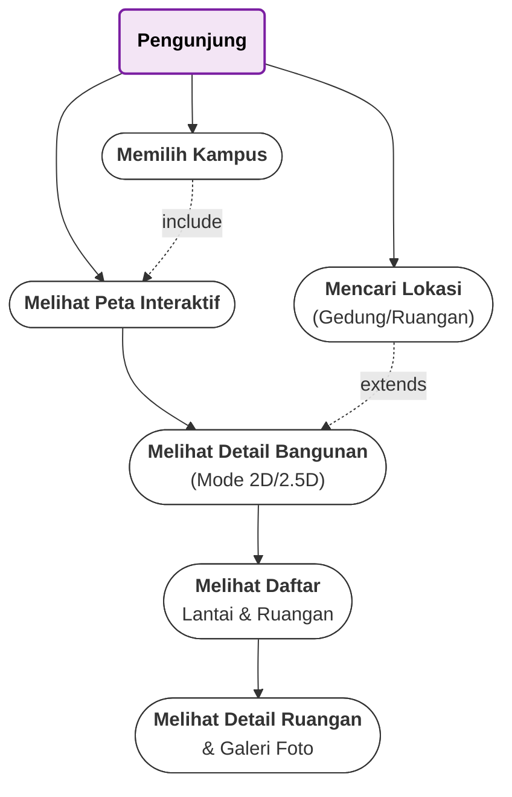
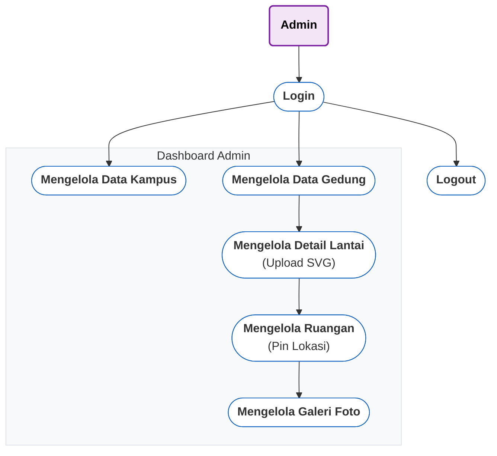

# Use Case Diagram PointMap (Revised - Flowchart Style)

Kode Mermaid ini menggunakan tipe `graph TD` (Flowchart) yang lebih stabil namun distyling agar terlihat seperti Use Case Diagram (bentuk Oval).

## 1. Use Case Diagram Pengunjung

## 2. Use Case Diagram Admin

